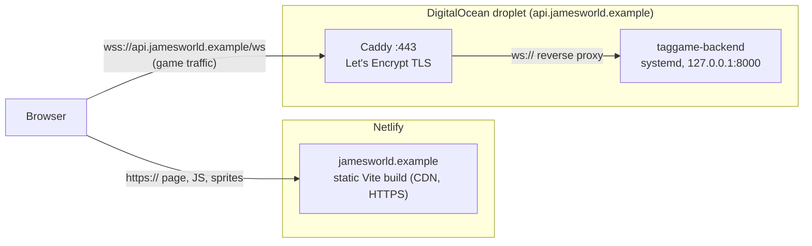

# tag-26

A multiplayer game of tag in the browser: every player is a "James", the
server decides who's IT, and you run around a schoolyard trying not to get
tagged.

- [`backend/`](backend): the game server. Rust (Axum + Tokio), server-authoritative,
  WebSockets. It owns the whole world: movement, energy, tagging, bots.
- [`phaser-tag-client/`](phaser-tag-client): the browser client. Phaser 3 +
  TypeScript, built with Vite. It sends inputs and draws the server's snapshots.

## Run it locally

```bash
cd backend && cargo run                              # game server on :8000
cd phaser-tag-client && npm install && npm run dev   # client on :5173
```

Open http://localhost:5173. No config needed: the client connects to the
same host on port 8000. Phones on your Wi-Fi can play too (`npm run dev -- --host`,
then open `http://<your-laptop-ip>:5173`).

## How it's deployed

One domain, two hostnames (`jamesworld.example` stands in for your domain):



- **Frontend:** Netlify builds `phaser-tag-client` on every push to `main`
  and serves it on your domain. `VITE_WS_URL=wss://api.jamesworld.example/ws`
  (set in the Netlify UI) tells the page where the server is.
- **Backend:** one Rust binary on an Ubuntu droplet, run by systemd, with
  Caddy in front for HTTPS. The browser connects to it directly, since
  Netlify can't proxy WebSockets.
- **DNS:** the apex/`www` records point at Netlify; `api` (`A`/`AAAA`) points
  at the droplet.

Step-by-step guides:

- Frontend (Netlify, custom domain, env vars): [phaser-tag-client/README.md#deployment-netlify](phaser-tag-client/README.md#deployment-netlify)
- Backend (droplet, Caddy, systemd, firewall, logs): [backend/README.md#production-deployment](backend/README.md#production-deployment)
- Upgrading the server without (much) downtime: [backend/README.md#redeploying-and-upgrading](backend/README.md#redeploying-and-upgrading)

**Redeploys in one line each:** Netlify deploys are atomic, so nobody notices.
A backend deploy restarts the server: the in-memory world (positions, IT,
names) starts fresh, and players see "Not Connected" for about a second while
their clients reconnect and rejoin automatically.
