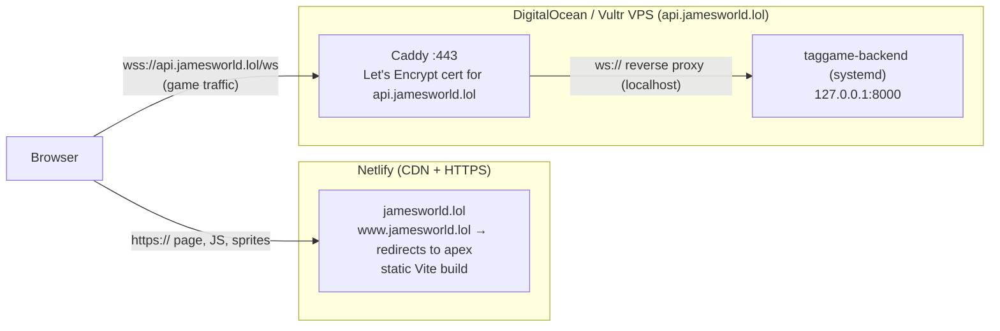

# Deploying James World

This is the one place that explains how James World runs in production. It
covers DNS, the Netlify frontend, the game server on a DigitalOcean or Vultr
VPS, redeploys, and troubleshooting.

| What | Where | URL |
|---|---|---|
| Game page (Vite build of `phaser-tag-client/`) | Netlify | `https://jamesworld.lol` (and `https://www.jamesworld.lol`, which redirects to it) |
| Game server (Rust, `backend/`) | VPS: Caddy on :443 in front of the server on `127.0.0.1:8000` | `wss://api.jamesworld.lol/ws` (health check: `https://api.jamesworld.lol/health`) |



Why it's built this way:

- **Two hosts, one domain.** Netlify only serves static files. It can't run
  the game server, and its proxy/rewrite rules can't carry WebSockets. So the
  page comes from Netlify, and the browser opens its WebSocket **directly** to
  `api.jamesworld.lol`.
- **`wss://`, not `ws://`.** The page is `https://`, and browsers block plain
  `ws://` sockets from secure pages ("mixed content"). Caddy on the VPS
  provides the TLS certificate for `api.jamesworld.lol` and fetches it by
  itself.
- **Port 8000 is private.** The Rust server listens only on `127.0.0.1`. The
  internet reaches it only through Caddy on 443.

Contents:

1. [DNS](#1-dns)
2. [Netlify (frontend)](#2-netlify-frontend)
3. [VPS (backend): DigitalOcean or Vultr](#3-vps-backend-digitalocean-or-vultr)
4. [Redeploying](#4-redeploying)
5. [Troubleshooting](#5-troubleshooting)

---

## 1. DNS

### What each name points at

| Name | Points at | Why |
|---|---|---|
| `jamesworld.lol` (apex, `@`) | **Netlify** | serves the game page |
| `www.jamesworld.lol` | **Netlify** | Netlify redirects it to the apex |
| `api.jamesworld.lol` | **your VPS's IP address** | the game server (Caddy) |

Don't mix these up:

- **`api` must NOT point at Netlify.** Netlify doesn't run the game server
  and can't proxy WebSockets, so `wss://api.jamesworld.lol/ws` would fail.
  Caddy also can't get a certificate for a name that doesn't resolve to its
  own machine.
- **The apex and `www` must NOT point at the VPS.** Netlify has to see
  requests for them to serve the page and issue their certificate. The VPS
  has no copy of the page, and Caddy is only configured for
  `api.jamesworld.lol`.

### Variant A (recommended): keep DNS where it is, add records

Leave your nameservers alone, whether DNS is at your registrar or at
DigitalOcean, Vultr or Cloudflare DNS. Add these records:

| Type | Name / Host | Value / Target | TTL | Notes |
|---|---|---|---|---|
| `A` | `@` | `75.2.60.5` | 3600 | Netlify's load balancer. **Better, if your provider offers it:** an `ALIAS` / `ANAME` / flattened `CNAME` on `@` → `apex-loadbalancer.netlify.com` instead of the A record. |
| `CNAME` | `www` | `<your-site>.netlify.app` | 3600 | Your site's Netlify subdomain (Site overview, e.g. `james-world.netlify.app`). |
| `A` | `api` | `<VPS IPv4>` | 300 | e.g. `203.0.113.10`, from the DigitalOcean/Vultr dashboard. |
| `AAAA` | `api` | `<VPS IPv6>` | 300 | **Only** if the VPS has a working public IPv6 address (see the caution below). Otherwise leave it out. |
| `CAA` *(optional)* | `@` | `0 issue "letsencrypt.org"` | 3600 | Only needed if you already have CAA records. See [CAA](#caa-records). |

Notes:

- **Netlify values.** The `75.2.60.5` IP and `apex-loadbalancer.netlify.com`
  target come from Netlify's docs, [Configure external DNS for a custom
  domain](https://docs.netlify.com/manage/domains/configure-domains/configure-external-dns/)
  (checked October 2026). When you add the domain, Netlify also shows the
  exact values for your site under *Domain management* → *Pending DNS
  verification*. If they differ, use Netlify's.
- **Delete conflicting records first.** Registrars often create default
  records for `@` and `www`, such as a parking-page `A`, an `AAAA`, a
  `CNAME`, or URL forwarding. Remove all of them. Keep exactly one record for
  `@`: the A record or the ALIAS/ANAME/flattened CNAME, never both. In
  particular, leave **no `AAAA` on `@`**, because it would send IPv6 visitors
  somewhere other than Netlify.
- **TTL.** 300 seconds (5 minutes) on `api` means a VPS move or IP change
  takes effect within minutes. If your provider has an "Automatic" TTL, that
  is fine for `@` and `www`. If you're replacing old records, lower their TTL
  to 300 a day before the switch, so caches expire quickly.
- **IPv6 caution for `api`.** When an `AAAA` record exists, Let's Encrypt
  tries IPv6 first. If IPv6 doesn't actually reach Caddy, certificate
  issuance fails. Only add the `AAAA` if the VPS has a public IPv6 address:
  - DigitalOcean: enable IPv6 on the droplet.
  - Vultr: IPv6 is usually assigned automatically.
  - Test from another IPv6-capable machine: `curl -6 http://api.jamesworld.lol`
    should get a response from Caddy.
- **No proxying.** All records point straight at their targets, with no CDN
  or proxy in between. This matters with Cloudflare DNS:
  - **`api` must be "DNS only" (grey cloud)**, at least while Caddy gets its
    certificate. With the orange cloud, Cloudflare terminates TLS itself, so
    Caddy's TLS-ALPN challenge can't work and its HTTP challenge can be
    broken by Cloudflare's HTTPS redirects.
  - Cloudflare's proxy does carry WebSockets. If you want it in front of
    `api` later, set SSL/TLS mode to *Full (strict)* and keep port 80
    reachable for renewals, or switch Caddy to the DNS challenge (needs a
    Caddy build with the `caddy-dns/cloudflare` plugin). There's no need
    for it now.
  - Keep `@` and `www` grey-cloud too. Netlify must terminate TLS itself to
    issue its certificate.

### Variant B (also fine): Netlify DNS

This variant moves the whole domain's DNS to Netlify:

1. In Netlify, go to *Domain management* → your domain → *Set up Netlify
   DNS*.
2. At your registrar, change the nameservers to the four
   `dnsN.p0X.nsone.net` servers Netlify lists.
3. Netlify creates the records for `jamesworld.lol` and `www` itself, and
   serves the apex from its CDN too.
4. **Add the API record yourself** in Netlify (*Domains* → `jamesworld.lol`
   → *DNS settings* → *Add new record*):

| Type | Name | Value | TTL |
|---|---|---|---|
| `A` | `api` | `<VPS IPv4>` | 300 |
| `AAAA` | `api` | `<VPS IPv6>` *(only if IPv6 works, as above)* | 300 |

Before switching, copy every existing record that you still need, such as
email (`MX`, SPF/DKIM `TXT`), into Netlify DNS. The nameserver switch can
take up to a day to propagate.

**Which variant to pick?** Variant A changes the least and keeps all records
in one familiar place. Variant B gives the apex domain Netlify's full CDN
routing, where Variant A sends it through one load-balancer IP. For a
browser game, the page is a few files that load once, and the latency that
matters is to the game server. Either way is fine.

### API on a different domain?

If the game server should live on a different domain (for example
`api.jamesworld.com` while the page stays on `jamesworld.lol`), add the
`api` `A`/`AAAA` records in **that** domain's DNS instead. Then use that
hostname everywhere the API name appears:

- the site address in [`backend/deploy/Caddyfile`](../backend/deploy/Caddyfile)
- `VITE_WS_URL` in Netlify (`wss://api.jamesworld.com/ws`), followed by a
  redeploy of the frontend

`ALLOWED_ORIGINS` doesn't change. It lists the page's origins
(`https://jamesworld.lol,https://www.jamesworld.lol`), not the API's. If the
page moves to a new domain, update `ALLOWED_ORIGINS` as well.

### CAA records

Most domains have no CAA records, and then any certificate authority may
issue certificates, so there's nothing to do. Check with
`dig +short CAA jamesworld.lol`. If that prints anything, it must allow
Let's Encrypt, which Netlify and Caddy both use:

```text
jamesworld.lol.  3600  IN  CAA  0 issue "letsencrypt.org"
```

Caddy falls back to ZeroSSL if Let's Encrypt is unreachable. To allow that
too, add `0 issue "sectigo.com"`. Netlify documents CAA in [HTTPS
(SSL)](https://docs.netlify.com/manage/domains/secure-domains-with-https/https-ssl/).

### Check DNS

Propagation takes minutes, sometimes hours. Run these from your own computer:

```bash
dig +short jamesworld.lol          # 75.2.60.5 (or Netlify IPs if you used ALIAS / Netlify DNS)
dig +short www.jamesworld.lol      # <your-site>.netlify.app. followed by Netlify IPs
dig +short api.jamesworld.lol      # your VPS IPv4
dig +short AAAA api.jamesworld.lol # your VPS IPv6, or nothing if you skipped it
dig +short CAA jamesworld.lol      # usually empty
```

If `dig` isn't installed, use `nslookup jamesworld.lol` or
<https://dnschecker.org>. Once Netlify and the VPS are set up (below), run
these checks:

```bash
curl -I https://jamesworld.lol                 # HTTP/2 200, "server: Netlify"
curl -I https://www.jamesworld.lol             # 301 → https://jamesworld.lol/
curl https://api.jamesworld.lol/health         # {"service":"taggame-backend","status":"ok"}

# WebSocket (either tool; Ctrl-C to quit). Expect {"type":"Hello",...}, then
# a stream of {"type":"Snapshot",...} messages.
npx wscat -c wss://api.jamesworld.lol/ws
websocat wss://api.jamesworld.lol/ws

# Origin check: the site's own origin is accepted, others get 403.
npx wscat -c wss://api.jamesworld.lol/ws -o https://jamesworld.lol      # connects
npx wscat -c wss://api.jamesworld.lol/ws -o https://example.org         # "Unexpected server response: 403"
```

---

## 2. Netlify (frontend)

The build settings live in
[`phaser-tag-client/netlify.toml`](../phaser-tag-client/netlify.toml):

- build command `npm ci && npm run build`
- publish directory `dist`
- Node 22
- cache headers

In the UI you set the base directory, one environment variable and the
domain.

1. **Create the site.** In Netlify, go to *Add new project* → *Import an
   existing project* → GitHub → `tag-26`.

   | Setting | Value |
   |---|---|
   | Branch to deploy | `main` |
   | Base directory | `phaser-tag-client` |
   | Build command / Publish directory | leave as detected; `netlify.toml` sets them (`npm ci && npm run build`, `dist`) |

2. **Set the server URL before the first real deploy.** Go to *Site
   configuration* → *Environment variables* → *Add a variable*:

   ```text
   VITE_WS_URL = wss://api.jamesworld.lol/ws
   ```

   Vite bakes this into the JavaScript **at build time**. A value in the
   build environment beats the committed `.env` file. After adding or
   changing it, rebuild with *Deploys* → *Trigger deploy* → *Deploy site*.
   Without it, the page would try `wss://jamesworld.lol:8000/ws`, which
   doesn't exist.

3. **Add the domains.**
   1. Go to *Domain management* → *Add a domain* and enter `jamesworld.lol`.
      Netlify adds `www.jamesworld.lol` automatically.
   2. Make **`jamesworld.lol` the primary domain** (*Options* → *Set as
      primary domain*). Netlify then redirects `www` and
      `<your-site>.netlify.app` to it.
   3. Create the DNS records from [section 1](#1-dns). Until they
      propagate, Netlify shows *Awaiting External DNS* or *Pending DNS
      verification*, which is normal.

   Netlify's docs mention that with external DNS, a `www` primary gets
   slightly better CDN routing than an apex primary. If you prefer
   `www.jamesworld.lol` as the main address, make it primary instead; both
   names work either way.

4. **HTTPS.** Under *Domain management* → *HTTPS*, Netlify provisions a
   Let's Encrypt certificate for `jamesworld.lol` and `www.jamesworld.lol`
   once DNS points at it. This usually takes a few minutes after DNS
   propagates. If it says it's waiting for DNS, wait or click *Verify DNS
   configuration*. Turn on *Force HTTPS* if it isn't already on.

5. **Check** `https://jamesworld.lol`. The status panel shows your `James N`
   in green once the socket is connected. This needs the backend from
   [section 3](#3-vps-backend-digitalocean-or-vultr) to be running.

About `node_modules`:

- `phaser-tag-client/node_modules` is committed from a Mac, so it lacks the
  Linux builds of rollup and esbuild.
- The build command starts with `npm ci`, which deletes it and installs
  exactly what `package-lock.json` lists for Netlify's Linux machines.
- A worthwhile follow-up is to stop committing it:
  `git rm -r --cached phaser-tag-client/node_modules`, then add it to
  `.gitignore`.

Pull requests get Netlify deploy previews. They talk to the real server,
which rejects their origin until you add it to `ALLOWED_ORIGINS`, e.g.
`https://deploy-preview-12--<your-site>.netlify.app`.

---

## 3. VPS (backend): DigitalOcean or Vultr

The steps are the same on both providers; only the dashboards differ. In
the commands below, replace `203.0.113.10` with your VPS's IP.

### Order of operations

Caddy proves to Let's Encrypt that it controls `api.jamesworld.lol`. To do
that, the name must already resolve to this machine, and ports 80/443 must
be open. Do things in this order:

1. Create the VPS and note its IP.
2. Add the `api` DNS record and wait until `dig +short api.jamesworld.lol`
   shows that IP.
3. Open the firewall (22, 80, 443).
4. Install the game server and start it (`tag26`).
5. Install the Caddyfile and start or reload Caddy. It gets the certificate
   within seconds.
6. Verify with `curl https://api.jamesworld.lol/health`.

If you start Caddy too early, it keeps retrying in the background with
backoff. A `systemctl reload caddy` after DNS is right makes it try again
immediately.

### 3.1 Create the VPS

- **DigitalOcean:** *Create* → *Droplets*. Choose Ubuntu 24.04 (LTS) x64
  and a Basic plan (the 1 GB plan runs the game easily). Add your SSH key,
  and tick *Enable IPv6* if you want the `AAAA` record.
- **Vultr:** *Deploy* → *Cloud Compute (Shared CPU)*. Choose Ubuntu 24.04
  LTS x64, the 1 GB plan, and your SSH key. IPv6 is normally assigned
  automatically (check *Settings* → *IPv6*).

Pick the region closest to your players, since every move round-trips to
it. If you'll compile Rust **on** the VPS, choose 2 GB or add the swap file
shown below.

### 3.2 Firewall

**Provider firewall** (recommended in addition to ufw): allow inbound TCP
22, 80 and 443 from anywhere, then attach it to the VPS.

- DigitalOcean: *Networking* → *Firewalls*
- Vultr: *Products* → *Network* → *Firewall*, add a group, then link the
  instance to it

**ufw on the machine.** Some images ship with ufw already on and only SSH
open (Vultr's often do). These commands are safe either way:

```bash
ssh root@203.0.113.10

apt update && apt upgrade -y
ufw allow OpenSSH
ufw allow 80/tcp
ufw allow 443/tcp
ufw --force enable
ufw status            # 22, 80, 443 (v4 and v6). Port 8000 stays closed: the server binds to 127.0.0.1.
```

### 3.3 User, directory and Caddy

```bash
# Unprivileged user the game server runs as
useradd --system --no-create-home --shell /usr/sbin/nologin tag26
mkdir -p /opt/tag26

# Caddy from its official apt repo (https://caddyserver.com/docs/install#debian-ubuntu-raspbian)
apt install -y debian-keyring debian-archive-keyring apt-transport-https curl
curl -1sLf 'https://dl.cloudsmith.io/public/caddy/stable/gpg.key' | gpg --dearmor -o /usr/share/keyrings/caddy-stable-archive-keyring.gpg
curl -1sLf 'https://dl.cloudsmith.io/public/caddy/stable/debian.deb.txt' | tee /etc/apt/sources.list.d/caddy-stable.list
chmod o+r /usr/share/keyrings/caddy-stable-archive-keyring.gpg /etc/apt/sources.list.d/caddy-stable.list
apt update && apt install -y caddy
```

Installing the package starts Caddy with a placeholder page on port 80. It
doesn't request any certificate until you install the real Caddyfile in
step 3.6.

### 3.4 Get the binary onto the VPS

Choose **one** of these.

**Option A: build on the VPS.** This is the simplest: no cross-compiling,
and the binary matches the VPS's libraries. Set up the toolchain once:

```bash
apt install -y build-essential rsync
curl --proto '=https' --tlsv1.2 -sSf https://sh.rustup.rs | sh -s -- -y
# 1 GB VPS: add swap so the compiler has room
fallocate -l 2G /swapfile && chmod 600 /swapfile && mkswap /swapfile && swapon /swapfile
echo '/swapfile none swap sw 0 0' >> /etc/fstab
```

Then build from your computer (in `backend/`):

```bash
rsync -az --delete --exclude target/ ./ root@203.0.113.10:tag26-src/
ssh root@203.0.113.10 'cd tag26-src && ~/.cargo/bin/cargo build --release --locked \
  && install -m 0755 target/release/taggame-backend /opt/tag26/taggame-backend'
```

**Option B: build on your computer and copy it.** On a Mac, build a static
Linux binary with [cargo-zigbuild](https://github.com/rust-cross/cargo-zigbuild):

```bash
brew install zig && cargo install cargo-zigbuild
rustup target add x86_64-unknown-linux-musl
cargo zigbuild --release --target x86_64-unknown-linux-musl
scp target/x86_64-unknown-linux-musl/release/taggame-backend root@203.0.113.10:/tmp/
ssh root@203.0.113.10 'install -m 0755 /tmp/taggame-backend /opt/tag26/taggame-backend'
```

On Linux x86_64, a plain `cargo build --release` works. Build on the same
Ubuntu version as the VPS or an older one, so glibc matches.

After this first install, [`backend/deploy/deploy.sh`](../backend/deploy/deploy.sh)
does either option in one command (see [Redeploying](#41-backend)).

### 3.5 systemd service

[`backend/deploy/tag26.service`](../backend/deploy/tag26.service) runs the
server as `tag26`, with these settings:

- `BIND_ADDR=127.0.0.1:8000`
- `RUST_LOG=info`
- `ALLOWED_ORIGINS=https://jamesworld.lol,https://www.jamesworld.lol`
- restart if it ever exits, and start at boot

From `backend/` on your computer:

```bash
scp deploy/tag26.service root@203.0.113.10:/etc/systemd/system/tag26.service
ssh root@203.0.113.10 'systemctl daemon-reload && systemctl enable --now tag26 \
  && sleep 1 && curl -s http://127.0.0.1:8000/health'
# {"service":"taggame-backend","status":"ok"}
```

The server reads these settings:

| Variable | Default | On the VPS | Meaning |
|---|---|---|---|
| `BIND_ADDR` | `0.0.0.0:8000` | `127.0.0.1:8000` | Listen address: `host:port`, or just an IP (then `PORT` supplies the port). |
| `PORT` | `8000` | | Port used when `BIND_ADDR` has none. |
| `ALLOWED_ORIGINS` | *(any)* | `https://jamesworld.lol,https://www.jamesworld.lol` | Page origins allowed to open `/ws`; others get `403`. Requests without an `Origin` header (scripts, bots) are allowed. |
| `RUST_LOG` | `info` | `info` | Log filter, e.g. `debug` or `info,taggame_backend=debug`. |

To change a setting later, run `systemctl edit tag26` (or edit the unit
file), then `systemctl daemon-reload && systemctl restart tag26`.

### 3.6 Caddy

[`backend/deploy/Caddyfile`](../backend/deploy/Caddyfile) is all it takes:

```caddyfile
api.jamesworld.lol {
	reverse_proxy 127.0.0.1:8000 {
		lb_try_duration 5s
		lb_try_interval 250ms
	}
}
```

What this does:

- Caddy gets and renews the certificate for `api.jamesworld.lol` itself.
- Plain HTTP is redirected to HTTPS.
- WebSocket upgrades pass through untouched.
- During a game-server restart, Caddy holds new connections for up to 5
  seconds instead of failing them.

To get Let's Encrypt expiry emails, you can add a global block at the top
of the file: `{ email you@example.org }`. This is optional.

Once `dig +short api.jamesworld.lol` shows the VPS IP:

```bash
scp deploy/Caddyfile root@203.0.113.10:/etc/caddy/Caddyfile
ssh root@203.0.113.10 'caddy validate --config /etc/caddy/Caddyfile && systemctl reload caddy'
ssh root@203.0.113.10 'journalctl -u caddy -n 30 --no-pager | grep -i certificate'
# ... "certificate obtained successfully" ... "identifier":"api.jamesworld.lol"
```

### 3.7 Verify

```bash
curl https://api.jamesworld.lol/health            # {"service":"taggame-backend","status":"ok"}
npx wscat -c wss://api.jamesworld.lol/ws          # {"type":"Hello",...}
```

Then open `https://jamesworld.lol` and press Start.

Logs on the VPS:

```bash
journalctl -u tag26 -f          # game server (live)
journalctl -u caddy -n 50       # certificates / proxy
systemctl status tag26 caddy
```

---

## 4. Redeploying

### 4.1 Backend

From `backend/` on your computer:

```bash
DEPLOY_HOST=root@api.jamesworld.lol ./deploy/deploy.sh                  # build on the VPS (Option A)
BUILD_ON=local DEPLOY_HOST=root@api.jamesworld.lol ./deploy/deploy.sh   # build here, copy (Option B)
DEPLOY_HOST=root@api.jamesworld.lol ./deploy/deploy.sh rollback         # put the previous binary back
```

`deploy.sh` works through these steps:

1. Builds the new binary. The old one keeps serving players meanwhile.
2. Swaps it into `/opt/tag26`, keeping the old one as
   `taggame-backend.prev`.
3. Runs `systemctl restart tag26`.
4. Waits for `/health`. If the server doesn't come up, it prints the logs.

A non-root `DEPLOY_HOST` user needs passwordless `sudo`.

What players experience:

- On `SIGTERM`, the server closes every socket with "service restart".
- The status panel turns red **Not Connected** for about 1–2 seconds.
- The client reconnects by itself, retrying after 0.5s, 1s, 2s, 4s, then
  every 5s.
- Anyone who had pressed Start rejoins automatically, in the same skin,
  under a fresh `James N`. People watching from the title screen just
  reconnect.

The world lives only in the server's memory, so a restart starts a new
round. Positions, who's IT and the name counter all reset.

Can the Rust server be upgraded without restarting? Not in place. A
compiled Rust program can't swap its own code, so upgrading means replacing
the process. There are ways to make that gentler:

- **Now (set up): fast restart + auto-reconnect.** A one-to-two-second
  blip, as described above.
- **Blue/green.** Start the new version on `127.0.0.1:8001`, point Caddy
  at it (`reverse_proxy 127.0.0.1:8001`, then `systemctl reload caddy`),
  then stop the old one.
  - New players never see a gap.
  - Until the old server stops, there are two separate worlds.
  - By default, Caddy closes proxied WebSockets when it reloads. Add
    `stream_close_delay 10m` inside `reverse_proxy` to let old games
    finish.
- **Later: hand the world over.** On shutdown, save the world to disk or
  Redis and restore it on boot. Give players a resume token so they get
  their `James N`, position and IT status back. A deploy then looks like a
  short lag spike.

### 4.2 Frontend

- **Deploy:** `git push` to `main`. Netlify builds and publishes
  automatically.
- **No downtime:** Netlify deploys are atomic. The new version goes live in
  one switch, nobody is disconnected, and players get it on their next page
  load.
- **Rollback:** in Netlify, go to *Deploys*, pick an earlier deploy and
  click *Publish deploy*.

### 4.3 When the protocol changes

The page and the server deploy separately, so for a while old pages may
talk to a new server, or the reverse. Keep changes backward-compatible:

- **Add fields; don't rename or remove them.** Give new fields to the
  server serde defaults (`#[serde(default)]`). Unknown fields are ignored
  on both sides.
- **Deploy the backend first, then the frontend.**
- **Never change what an existing message means.** Add a new message type
  instead.

### 4.4 Changing the IP, VPS or domain later

| Change | Do this |
|---|---|
| New VPS / new IP | Set up the new VPS (section 3), then change the `api` `A`/`AAAA` records to the new IP. With TTL 300, traffic moves within minutes. Caddy on the new machine gets its own certificate once DNS points there. Then shut down the old VPS. No frontend change needed. |
| Different API hostname | DNS record for the new name → Caddyfile site address → `systemctl reload caddy` → Netlify `VITE_WS_URL=wss://<new>/ws` → *Trigger deploy*. |
| Different page domain | Add it in Netlify *Domain management* (+ its DNS records) → add its origin to `ALLOWED_ORIGINS` (`systemctl edit tag26`, then restart). |
| Switching provider (DigitalOcean ↔ Vultr) | Same as *New VPS*. |

---

## 5. Troubleshooting

| Symptom | Likely cause | Fix |
|---|---|---|
| Page loads, status stays red **Not Connected**. DevTools → Network → WS shows `403`. | The page's origin isn't in `ALLOWED_ORIGINS` (e.g. `www` missing, or a deploy preview). | Add the exact origin (`https://host`, no path or trailing slash) to `ALLOWED_ORIGINS` and restart tag26. `journalctl -u tag26` shows `rejected WebSocket from a disallowed origin`. |
| Console: *Mixed Content … insecure WebSocket endpoint `ws://…`*, or the URL is `wss://jamesworld.lol:8000/ws`. | `VITE_WS_URL` was missing or wrong when Netlify built the site. | Set `VITE_WS_URL=wss://api.jamesworld.lol/ws` in Netlify, then *Trigger deploy*. Changing the variable alone does nothing until the next build. |
| Still the old server URL after changing `VITE_WS_URL`. | The deployed build is from before the change. | *Trigger deploy*, then hard-reload the page. Search the deployed JS for `api.jamesworld.lol` to confirm. |
| `curl https://api.jamesworld.lol/health` fails with a TLS or certificate error. Caddy logs show `challenge failed` or `no such host`. | DNS not propagated yet, `api` pointing somewhere else, Cloudflare proxy (orange cloud) on `api`, port 80/443 blocked, or a broken `AAAA`. | Check `dig +short api.jamesworld.lol` (and `AAAA`), set Cloudflare to DNS-only, open 80/443 in both the provider firewall and ufw, remove the `AAAA` if IPv6 doesn't work. Then `systemctl reload caddy`. |
| `curl https://api.jamesworld.lol/health` returns `502`. | Caddy is fine but the game server isn't running. | Run `systemctl status tag26` and `journalctl -u tag26 -n 50`. |
| Netlify shows **Awaiting External DNS** / *Pending DNS verification*, or no certificate. | The apex/`www` records aren't in place yet, there's a leftover registrar record (`AAAA` on `@`, URL forwarding), or Cloudflare is proxying. | Fix the records per [Variant A](#variant-a-recommended-keep-dns-where-it-is-add-records), wait for the TTL, then click *Verify DNS configuration*. |
| `www` doesn't redirect, or shows another site. | The `www` `CNAME` is missing or points somewhere else. | `CNAME www → <your-site>.netlify.app`. |
| Certificate refused with a CAA error. | A CAA record doesn't allow Let's Encrypt. | Add `0 issue "letsencrypt.org"` (see [CAA](#caa-records)). |
| Players get dropped during every deploy. | Expected: a restart starts a new world. | They reconnect within about 1–2 seconds. See [4.1](#41-backend) for gentler options. |
